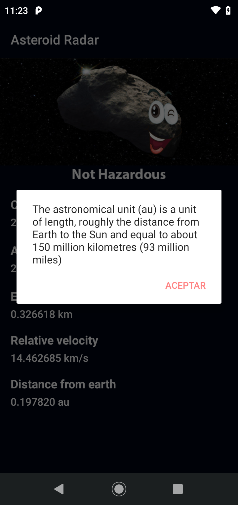

# Asteroid Radar

Asteroid Radar is an app to view the asteroids detected by NASA that pass near Earth. The information of these asterioids is gotten from a free, open source API provided by NASA JPL Asteroid team.
This  is a project for the Udacity Android kotlin Nanodegree Program.

## Libraries
- RecyclerView
- Navigation Component
- ViewModel
- LiveData
- Room
- Databinding
- Material Design Component
- Retrofit
- Moshi
- WorkManger
- Piccaso

## Prerequisite
To build this project, you require:
- Android Studio artic fox
- Gradle 7.0

## API Key
To get an API Key from NASA to perform network requests to Nasa servers.
You need to generate an api key by going to https://api.nasa.gov/ 
```
Fill the required fields 
Click the Signup Button
You are going to get your API key Instantly and also it will be sent to your 
email address.
```

## Screenshots
<h4 align="center">





## Author
Babatunde OWoleke

## License
This project is licensed under the Apache License 2.0 - See: http://www.apache.org/licenses/LICENSE-2.0.txt


